<h1 style="text-align: center;">Issues I Faced and How I Overcame Them</h1>

<a href="/workspace/milestone-re-tie-dye/README.md">Main README.md file</a>

<h3>Bullet Point Issue</h3>

The Home page was looking great, I used a Bootstrap component called Jumbotron to quickly and effectually instruct the visitor on how to use the website. I decided the best way was to use an un ordered list, but the bullet points didn't look right. They were too far away from the text once I centered the text using my text-center class. 

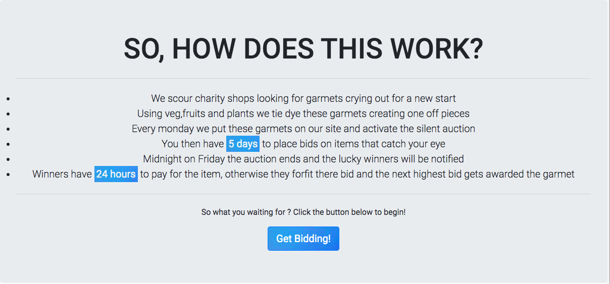

To get past this issue I added the class of lead to my ul, then in style.css I used list-style-position to bring the bullet points closer to the text. This looked a great deal better and made the instructions clearer to understand. 

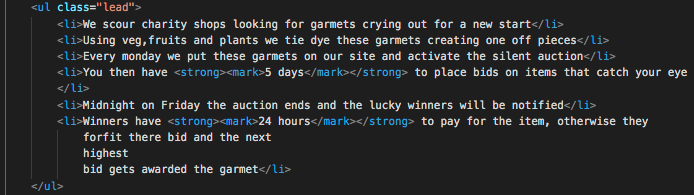

<i>HTML code used in bullet point fix</i>

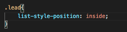

<i>css code used in bullet point fix</i>

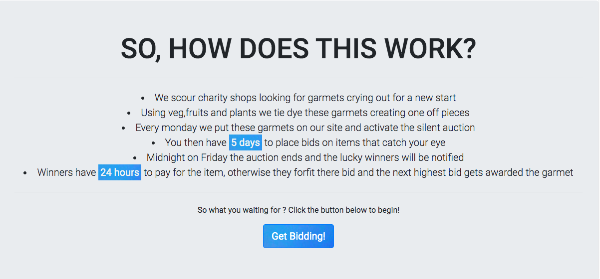
    
<i>How the page looked after the fix was applied</i>

However, later in the process of building this website I still wasn't happy with how the list was looking. Due to the differing lengths of the sentences it still wasn't looking centered. I decided to use Bootstrap class justify-content-center on the parent div containing the un-ordered list. I then used another Bootstrap class text-left to make the text items of the list start from the left. This looked centered and it solved the issue of differing text lengths. 

<h3>Centering Social Icons</h3>

I struggled to get the social icons to center in the footer.

I tried using combination of different Bootstrap layout components like row justify-content-center with a single col-12 but the icons wouldn't center. I found that if I used three col-4 and copied the HTML for the social icons into the 2nd col-4, and then left the first and third col empty the icons would appear close the the center. I then created a class called social-align to  align the icons to get the desired affect. I've included images of the HTML code below. 

I am sure this isn't a perfect fix and as my journey continues I would like to find another solution.

<h3>Improving Header Responsiveness</h3>

The header was looking good on desktop screens, but on small screen and remote devices the header took up too much room on screen sizes below 767px. 

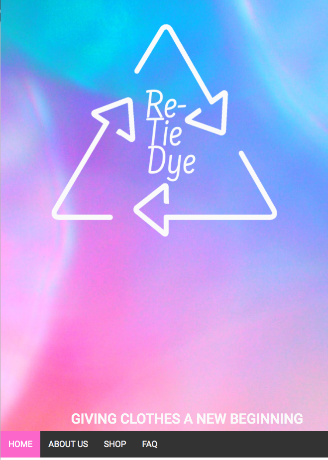

 I used media queries in my style.css so that when screen sizes went below 767px they didn't display the second col containing the websites tagline. The tagline took up too much space, and didn't provide any benefit to a remote users experience

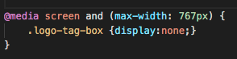

<h3>Improving Layout of About Us</h3>

The order of the hero images and paragraphs on the about me page looked good for mobile devices, as shown in the image below: 

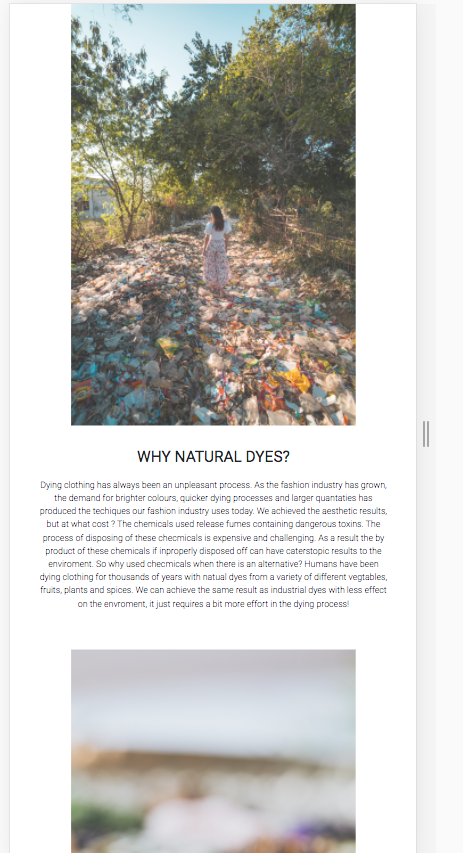

However, I didn't like the way the order worked on larger screen sizes. 

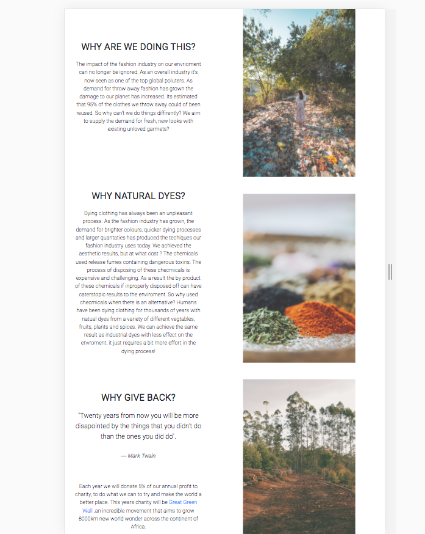

To get passed this issue I used Bootstrap order to change the order between one hero and one paragraph in small breakpoints and above. This makes the about us page more responsive, and improved the experience for visitors using a variety of different devices. 

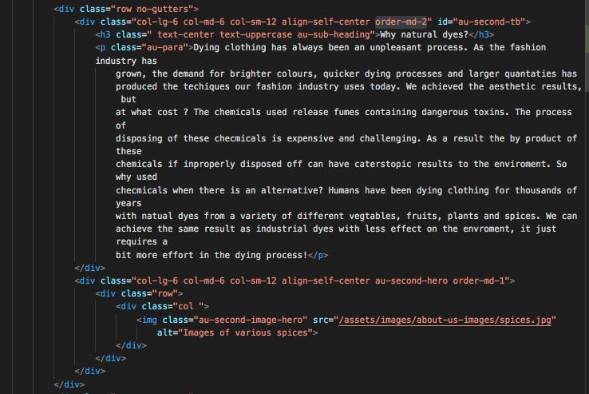

<i>Image of HTML code used to fix the about me layout</i>

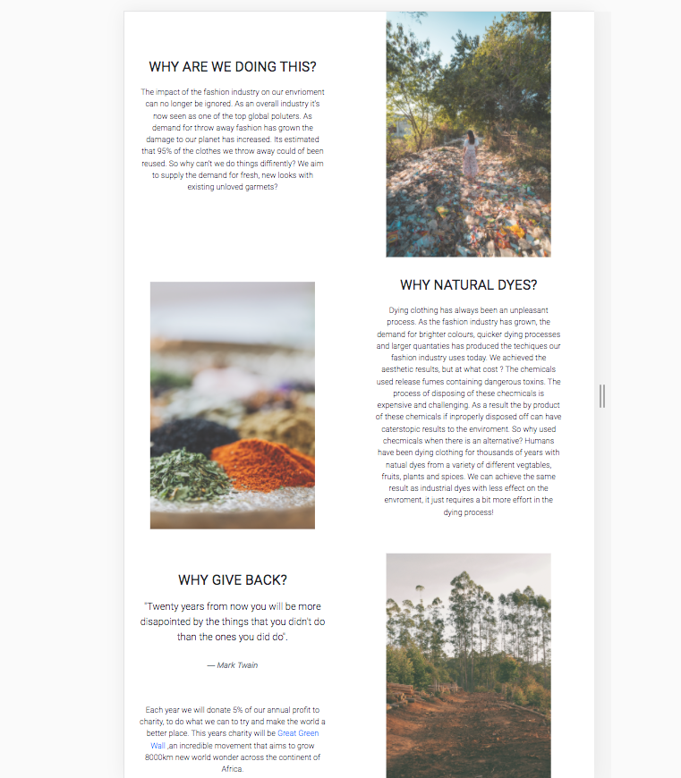

<i>Image of about me after the HTML fix code has been deployed</i>

<h3>Improving FAQ Responsiveness</h3>

The FAQ page looked good on large screen sizes, but the hero image took up too much space on smaller screen sizes. It also left a lot of blank space on medium and small screen sizes.

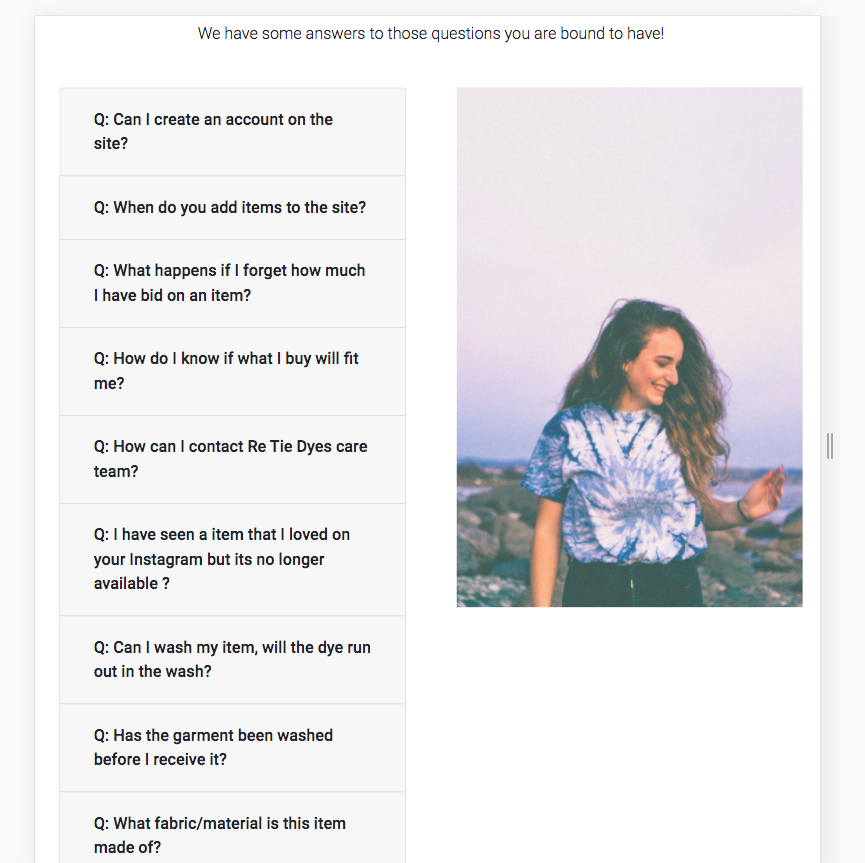

<i>Hero leaving too much room on medium screen sizes.</i>

To get past this issue I used a second hero image and slotted it just underneath the original hero using a div. I then used Bootstap d-none, d-sm-block, d-sm-none, d-md-block, d-md-none and d-lg-none. I used d-none, d-md-block and d-lg-none on image of the male model, so it would only show in medium screen sizes. 
 
 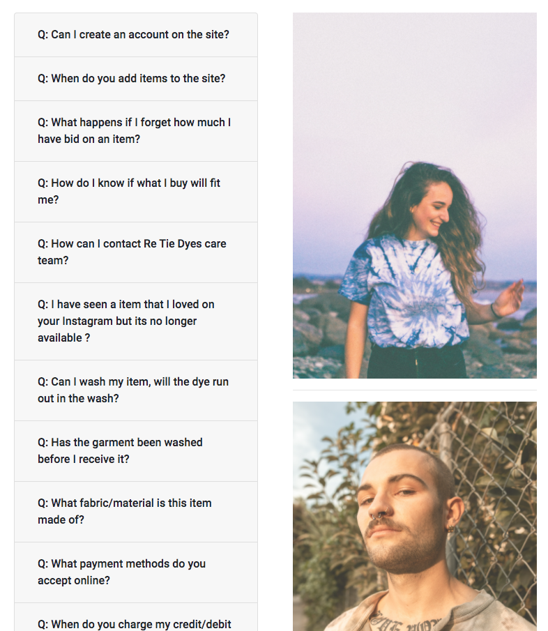

<i>Medium screen size after inclusion of male model hero.</i>
 
 This solved the issue of too much blank space in medium screen sizes. In addition it wouldn't show in small screen sizes either, which wouldn't compound the issue of the hero images taking up too much screen size. I then used d-none, d-sm-none and d-md-block on the original female. This prevented the hero from appearing in smaller screen sizes thus making the website more responsive. This has now improved the user experience for those viewing the FAQ page on a remote device. 

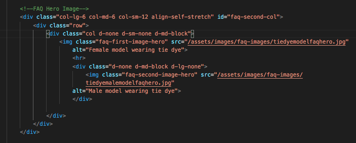
<i>HTML code I used to fix to make the FAQ more responsive.</i>

