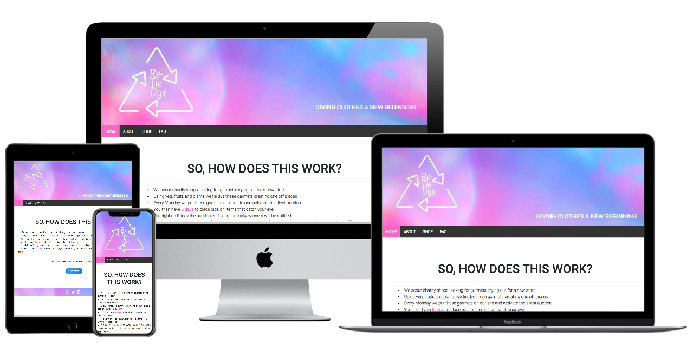
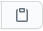
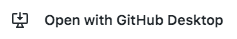

<h1 style="text-align: center;">Re-Tie Dye Website</h1>
<a href="https://rvn-r.github.io/milestone-re-tie-dye/index.html" target="_blank">View the live project here.</a>

This is the main shop front for the Re-Tie Dye organization. It is designed to be responsive and accessible on a range of devices, making it easy to navigate and meet the client's key goals. 

</img>

# Client Requirements
* We need a platform that illustrates and shares our key values.
* We need a platform that depicts and captures the brand's ethos.
* We need a platform that makes those visiting it empowered and confident to use.
* We need a platform that is a safe and non-toxic environment to inhabit.  

# User Experience (UX)

* ## User Stories

    * ### First Time Visitor Goals

        1. As a First Time Visitor, I want to easily understand the main purpose of the site, and learn more about the organization's founding values. 
        1. As a First Time Visitor, I want to be able to easily navigate throughout the site to find key content. 
        1. As a First Time Visitor, I want to clearly find out what makes this organization different from its competitors. 
        1. As a First Time Visitor, I want to source information that validates the organization's legitimacy and the most efficient way to do this is through their social media.  

    * ### Returning Visitor Goals

        1. As a Returning Visitor, I want to be able to navigate to the store quickly. 
        1. As a Returning Visitor, I want to be notified when new auctions go live.
        1. As a Returning Visitor, I want to be able to place a bid on an item quickly. 
        1. As a Returning Visitor, I want to quickly see if any changes have been made to the "So, How Does This Work?" section.

    * ### Frequent User Goals

        1. As a Frequent User, I want to check to see if there are any newly added items in the store. 
        1. As a Frequent User, I want to see if any new auctions are going live soon. 
        1. As a Frequent User, I want the platform to recognise I have visited and used it before. 

# Design 

   ### Color Scheme  
   I took my main inspiration on the colour scheme for the site's header and footer from the Tie Dye background image by <a href="https://unsplash.com/@sharonmccutcheon">Sharaon McCutcheon</a>. I've listed the hex numbers of the colours I used below.
        
 * #fc66ca
 * #fcb9fc
 * #8ab0ef
 * #cfb0f3
     
  ### Typography 
  Roboto is the font chosen for use across the site, with Sans Serif as the back up font in case there are any issues importing into the site correctly from Google Fonts. Kavoon was also used in the creation of the client's logo using Photoshop. Roboto and Kavoon both help convey the client's brand connotations and ethos, so both meet the client's requirements in a font. 

  ### Wireframe Mockups - Desktop
   * <a target= "_blank" href="readme-assets/readme-images/Desktop-Home .png"> Home</a>
   * <a href="readme-assets/readme-images/Desktop-AboutUs.png">About</a>
   * <a href="readme-assets/readme-images/Desktop-F.A.Q.png">F.A.Q</a>
   * <a href="readme-assets/readme-images/Desktop-Shop.png">Shop</a>
   * <a href="readme-assets/readme-images/Desktop-ItemPage.png">Item Page</a>
   * <a href="readme-assets/readme-images/Desktop-ItemPagePopOut.png">Item Page Pop Out</a>

   ### Wireframe Mockups - Mobile Device
   * <a href="readme-assets/readme-images/Mobile-Home.png">Home</a> 
   * <a href="readme-assets/readme-images/Mobile-Home-Nav.png">Home with Navigation</a>
   * <a href="readme-assets/readme-images/Mobile-About Us.png">About </a> 
   * <a href="readme-assets/readme-images/Mobile-AboutUs-Scrolled.png">About scrolled</a>  
   * <a href="readme-assets/readme-images/Mobile-FAQ.png">F.A.Q</a> 
   * <a href="readme-assets/readme-images/Moble-FAQ-Scolled.png">F.A.Q scrolled</a>
   * <a href="readme-assets/readme-images/Mobile-Shop.png">Shop</a> 
   * <a href="readme-assets/readme-images/Mobile-Shop-Scolled.png">Shop scrolled</a>
   * <a href="readme-assets/readme-images/Mobile-Item.png">Item Page</a> 
   * <a href="readme-assets/readme-images/Mobile-Item-Scroll.png">Item Page scrolled</a>
   * <a href="readme-assets/readme-images/Mobile-Item-Pop-Up.png">Item Page Pop Out</a>

# Features

Each page shares the same header and navigation bar. The header contains the client's logo and a sub heading with a tag line. The tag line succinctly reinforces the brand's ethics and mission statement. Just below the header is a navigation bar that runs the length of the page. The navigation bar features navigational links to Home, About , Shop and FAQ pages. The colours used for each of these navigational links is repeated on each page, to ensure coherency throughout the website. Each page has a footer with social media icons linking to the client's social media accounts. The footer echoes those colours and the background image used on the header, ensuring coherent design approach. 

<b><i>Home</i></b>

The Home page features a Jumbotron Bootleg Component as it's main feature. This catches the visitor's eye, and quickly explains the working of the website to them. Key information is highlighted using a striking pink. The colour creates contrast against the site's white background, and the shade of pink can be found in the background image used throughout the site on both the header and footer.  

A call to action button allows a visitor to navigate to the shop in one click to begin browsing the various garments. To compliment the rest of the site's colour palette a blue that is found in the background image was used for the call to action button. The blue is used exclusively on buttons that will ultimately aid the visitor in bidding on garments. Its my hope that returning visitors associate this blue with the task of bidding on items, thus making navigation through the site second nature.

<b><i>About</i></b>

The About page consists of three small paragraphs that quickly identify three unique selling points that distinguish the client's brand over its competitors. To make the text on the page more digestible I have used three images that reflect the brand's ethos, and also the content of the text. 

To make the page easier to read on remote devices I've changed the running order of how the paragraphs and images appear on larger screen sizes. The images now break up the paragraphs, so when scrolling down on a mobile device the text doesn't become overbearing, and is far easier to absorb. 

<b><i>FAQ</i></b>

The FAQ is laid out in two columns containing an accordion component and a hero image. The accordion saves space, and also allows the visitor to concentrate on specific questions and answers that concern them. 

The layout remains consistent until we get to remote screen sizes. In medium screen sizes a single image leaves a great deal of empty space, so a second hero image is used to improve the layout of the column. To improve remote screen size user experience, all hero images disappear and only the accordion remains. 

<b><i>Shop</i></b>

The Shop is relatively simple at this stage, but will allow the client to add additional garments as and when they become available. The page consists of three cards running across the screen from left to right. Below each image is key information on the garment, and then a call to action button should the visitor want to place a bid on the garment. The call to action button is the same blue as found on the call to action button on the Home page.  

# Existing Features

* Header Logo - Exists on every page and allows the user to easily recognise the client's brand. Clicking the logo   returns the user to the home page.
* Header Navigation Bar - Exists on every page and allows the user to easily navigate across the website.
* Footer Social Icons - Exists on every page and allows all users to access the client's social media platforms. 
* Call to Action Buttons - Exists on the Home and Shop page. They allow the user to quickly bid on a garment. 
* "So, How Does This Work?" - Is the first thing a visitor will see once they visit the home page. It allows potential clients to understand the steps involved in bidding on a garment. 
* About Us - Allows visitors to understand the client's journey, ethos and what they represent. 
* Modal for Images - Allows visitors to the shop to view garments easily without having to leave the website. The visitor can click on the garment's image and a pop out of that image will appear.  
* Modal for Bidding - Allows the visitors to easily express interest in a garment. Visitor clicks the button and a     modal appears, giving them the opportunity to register their email address. This enables the client to contact      the potential customer at a later date with information on future auctions.     

# Features Left to Implement

* <i>GDPR Checkbox</i> - Allows the visitor to approve the use of their email address to inform them of future auctions. Also ensures the client complies with EU data protection law. 
* <i>Garment pages</i> - Once the visitor clicks on a garment it will take them to a web page dedicated to that garment. It will provide additional images of the garment, more detailed information on the garment and an opportunity to bid on that garment. 
* <i>Count Down</i> - There will be a large count down on the home page notifying visitors of when the next auction will begin.    It will be synced to the website's back end when the auction goes live and when the auctions stops.   
* <i>Remote View Nav Bar</i> - In remote screen sizes current nav bar could become overbearing. Testing results gave conflicting feedback, so this feature may or may not be required. 
* <i>Additional Footer Menu</i> - As the client and visitor's requirements grow over time an additional footer menu will be required, linking the visitor to pages covering shipping & return and privacy policy & terms. 
* <i>Input Text Footer</i> - Here the visitor will be able to input their email address and their details so they can be notified on any exciting news in the future.
* <i>Site Back End</i> - The site is going to need a back end capable of quite extensive features. Not only will the back end need to keep track of bids on each specific auction, it will have to store these bids chronologically and from highest to lowest bid. Once the auction ends the backend will have to generate an email to be sent to the highest bidder notifying them that they have won. That email will also include a link back to the site to complete payment. 
* <i>Facility to Process Secure Online Payment</i> - As mentioned above the recipient of the winning bid email will be directed back to the site. The link will direct them to a secure location where they can make payment. 

# Technologies Used

* This website used HTML and CSS programming languages

* <a href="https://getbootstrap.com/">BootStrap CDN:</a> This project uses Bootstrap5 to help make the website responsive. 

* <a href="https://fonts.google.com/">Google Fonts:</a> This project uses Google Fonts to style the website's fonts.

* <a href="https://fontawesome.com/">Font Awesome:</a> This project uses Font Awesome throughout the website to add social media icons to the footer.

* <a href="https://popper.js.org/">Popper.js:</a> This project uses Popper.js Javascript for modal used on the Shop page.

* <a href="https://www.photoshop.com/en">Adobe Photoshop:</a> This project uses Photoshop to design and create the client's logo found in the header.

* <a href="https://balsamiq.com/">Balsamiq:</a> This project uses Balsamiq to create wireframes during the design process.

* <a href="https://git-scm.com/">Git:</a> Git was used for version control, using the Gitpod terminal to add, commit to Git and Push to GitHub.

* <a href="https://github.com/">GitHub:</a> GitHub was used to store the project's code after being pushed from Git.

* <a href="https://stackedit.io/app#">StackEdit:</a> StackEdit was used to confirm layout and spell check my README, ISSUES and TESTING md files.

# Testing

Testing information can be found on a separate <a href="TESTING.md">Testing Readme</a> I've also created a separate <a href="ISSUES.md">Issues Readme</a> that documents some of the bugs I experienced whilst creating this site and the steps I took to overcome them. 

# Deployment

## Github Pages

The project was deployed to GitHub Pages using the following steps: 
    
1.   Log in to GitHub and locate the correct GitHub Repository
2.   At the top of the Repository, locate the Settings button (settings should be depicted as three small dots).
3.   Scroll down the Settings page until you get to "GutHub Pages" section. 
4.   Under "Source", click the drop down called "None" and select "Master".
5.   Click "Save", the page will automatically refresh. 
6.   Scroll back down to "GitHub Pages" and you will now see the published <a href="https://rvn-r.github.io/milestone-re-tie-dye/">site</a> link. 

## Cloning Repository Using Command Line

1. Log in to GitHub and locate the correct GitHub Repository
2. Above the list located to the right of the green "Gitpod" button click code
3. Under Clone you will see three options HTTPS, SSH and GitHub CLI. Choose which option you prefer and then click the copy icon (<i>see image below</i>) next to the URL to copy it.

</img>

4. Open Terminal. 
5. Change the current working directory to the location where you want the cloned directory. 
6. Type git clone, and then paste the URL copied earlier during step 3. 
7. Press Enter to create your local clone. 

## Cloning Repository To GitHub Desktop
1. Log in to GitHub and locate the correct GitHub Repository
2. Above the list located to the right of the green "Gitpod" button click code
3. Click "Open with GitHub Desktop" (<i>see image below</i>) to clone and open the repository with GitHub Desktop. 

</img>

4. Follow the prompts in GitHub Desktop to complete the clone. 

# Credits 

## Code 

* I used the <a href="https://www.w3schools.com/howto/howto_js_topnav.asp">"How To - Top Navigation"</a> tutorial on w3schools.com as help and inspiration for my Navigation Bar on this site. 

* I used the <a href="https://getbootstrap.com/docs/4.5/components/card/">Bootstrap Component Card</a> as a foundation to stylise and present my main content on the Shop Page. 

* I used the <a href="https://getbootstrap.com/docs/4.5/components/collapse/#accordion-example">Bootstrap Component Collapse</a> and the accordion example as a foundation to stylise and present the answer and question section of the FAQ page.

* I used the <a href="https://getbootstrap.com/docs/4.5/components/jumbotron/">Bootstrap Component Jumbotron</a> to stylise and present the "So, How Does This Work?" section of the Home page.

## Content

All text content on this site including "About Us", "So, How Does This Work?", Shop and FAQ questions and answers have been written by me. 

Company Logo was created by me using Photoshop

## Media

Images used on this website were sourced from two websites <a href="https://unsplash.com/">Unsplashed</a> and <a href="https://www.pexels.com/">Pexels</a>

<u>Home Page Images</u>

* <a href="https://unsplash.com/photos/7EK5WABscqw">Tie Dye background image for header</a> created by <a href="https://unsplash.com/@sharonmccutcheon">Sharon Mccutcheon</a>

<u>About Page Images</u>

* <a href="https://www.pexels.com/@stijn-dijkstra-1306815">Image of Landfill Forest</a>
* <a href="https://www.pexels.com/@karolina-grabowska">Image of Spices in a Market</a>
* <a href="https://www.pexels.com/@oandremoura">Image of Deforestation</a>

<u>FAQ Page Images</u>

* <a href="https://www.pexels.com/@cameron-yartz-2341223">Female Model wearing Tie Dye</a>
* <a href="https://www.pexels.com/@rodnae-prod">Male Model wearing Tie Dye</a>

<u>Shop Page Images</u>

* All of the photos of garments were taken by me. 

## Acknowledgements

* Special thanks to my mentor Brian Macharia
* Special thanks to fellow students on Slack for support during completion of MS1
* Thanks to the team of tutors at Code Institute for their support. 